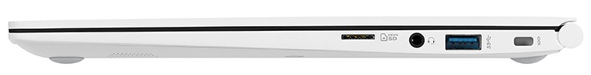

# TLDR

迷っているならWindowsがおすすめです。

私もそれを使っています。

# WindowsとMacを比較してみた

| 項目 | Windows | Mac |
|:---:|:-------:|:---:|
| **初心者向け**| ○ | △ |
| ユーザの人数 | ○ | △ |
| ウイルスの数 | 多い | 少ない |
| 対応している周辺機器の数 | ○ | ○ |
| 無料アプリの数 | ○ | × |
| メーカーの数 | ○ | × |
| 各種端子の数 | 機種依存 | × |
| スペックの選択肢 | ○ | △ |
| 更新 | △ | ○ |

## ユーザ数

ユーザーの数は、**MacよりもWindowsのほうが多いです。**

[引用元](https://news.livedoor.com/article/detail/17623703/)

例えば、パソコンの操作でわからないことがあるとしましょう。

ユーザーが多いということは、他のOSに比べて**同じことで困っている人が多いかもしれない**ということです。

つまりは、WindowsはMacと比べて、**検索をかけるだけで解決する可能性が高いと言えるでしょう。**

## ウイルス

ユーザー数が多いWindowsですが、**ユーザー数が多いからこそ、ハッカーなどに狙われます。**

ですが、**WindowsもMacもウイルス対策ソフトが予めインストールされているので、心配はありません。**

## 対応している周辺機器の数

両者とも対応している周辺機器は、非常に多いです。

これに関しては、ほとんど差はありません。

## 無料アプリの数

Windowsパソコンは、**無料で使えるアプリが非常に多いです。**

ほしいアプリを探してみると、「このアプリWindowsしか対応してないやんけ！」というアプリが結構あります。

**いろんなアプリを試してみたい！**　という方は、Windowsが向いているかもしれません。

## メーカー数

[引用元](https://ja.wikipedia.org/wiki/%E6%97%A5%E6%9C%AC%E9%9B%BB%E6%B0%97)

**これこそがWindowsの大きな特徴です。**

MacはAppleからしか出ていませんが、Windowsはたくさんのメーカーが製品を出しています。

Windowsの開発元であるMicrosoftだけでなく、NECや東芝の日本メーカーからLGなどの海外メーカーも製品を出しています。

つまり、**自分の好きなメーカーで選ぶこともできる**ということです。

それに比べ、MacはAppleしか製造していません。

ただ、Mac製品はAppleからしか出ていないからこそ、**選択肢が少なく迷わなくても良い**といったメリットとも取ることができます。

## 各種端子の数

LG GRAM

[引用元](https://www.lg.com/jp/pc/lg-13Z990-GA55J)

Mac Book

[引用元](https://support.apple.com/ja-jp/HT207443)

Windowsは様々なメーカーが製品を作っているため、**どんな入出力端子をつけるかはメーカーが選べます。**

つまり、**Windowsのほうが選択肢は広いです。**

私のお気に入りである[LG GRAM](https://www.lg.com/jp/lg-gram/index.html)とMacbookを比較すると、

|          端子         | LG GRAM |   Macbook   |
|:---------------------:|:-------:|:-----------:|
|       USB Type C      |    ○   |      ○     |
|       USB Type A      |    ○   |      ×     |
|          HDMI         |    ○   |      ×     |
|     ヘッドホン端子    |    ○   |      ×     |
| MicroSDカードリーダー |    ○   |      ×     |
|        充電端子       |    ○   | USB-Cで充電 |

**こんなに違います。**

さらに、MacbookはUSB-Cしかないため、USB-C → HDMI や USB-C → USB-A などの変換器を繋げなくてはいけなくなり、**変換器祭りとなります。**

それについては、こちらの動画が非常に参考になります。

<iframe width="560" height="315" src="https://www.youtube.com/embed/vswaus1lZAA?controls=0" frameborder="0" allow="accelerometer; autoplay; encrypted-media; gyroscope; picture-in-picture" allowfullscreen></iframe>

それに比べ最初からついているLG GRAMは、変換器を買わなくても困らないようになっています。

しかし、**これはWindowsPCすべてに言えることではありません。**  
WindowsPCでも、USB-Cしかついていない製品もあります。

## スペックの選択肢

[引用元](https://ja.wikipedia.org/wiki/%E3%82%A4%E3%83%B3%E3%83%86%E3%83%AB)

まず、**WindowsでもMacでもスペックは選べます。**

パソコンのスペックを決める部品の詳しい解説は、[こちら]()で解説していますが、選択肢の広さに関しては**Windowsに軍配が上がります。**

## 更新

WindowsもMacも、こまごまと更新が来ます。

では何で差がつくかというと、**Windowsは更新するごとに再起動が求められ、しかも再起動完了まで時間がかかります。**

3~4ヶ月ほど更新をサボったときには、再起動まで30分以上かかったこともありました。
~~嫌な思い出だった。~~

# まとめ

WindowsとMacの違いについておわかりいただけたでしょうか。

私はWindowsがおすすめです。

少しでも力になれたなら嬉しいです。
